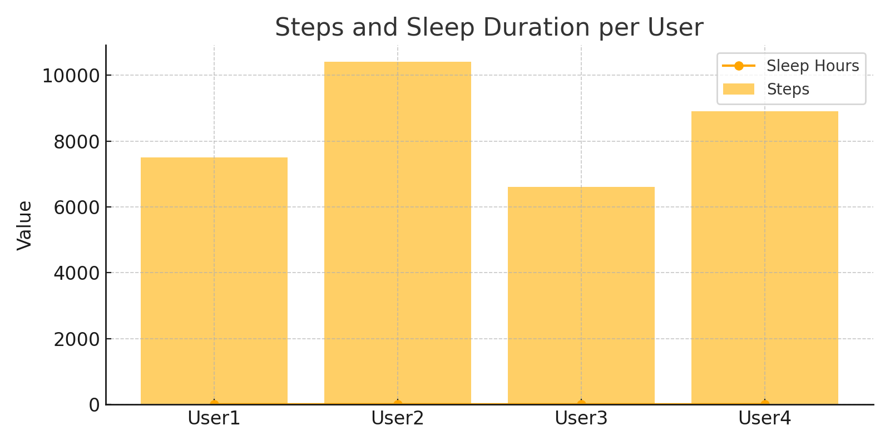
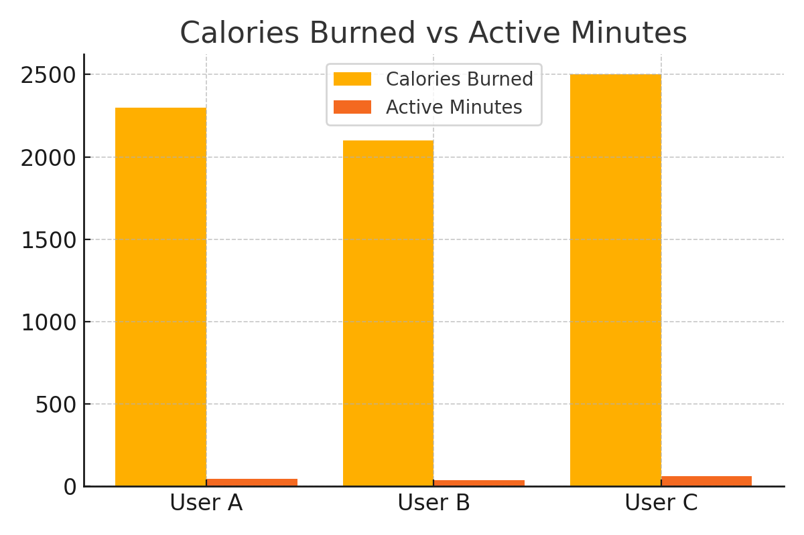
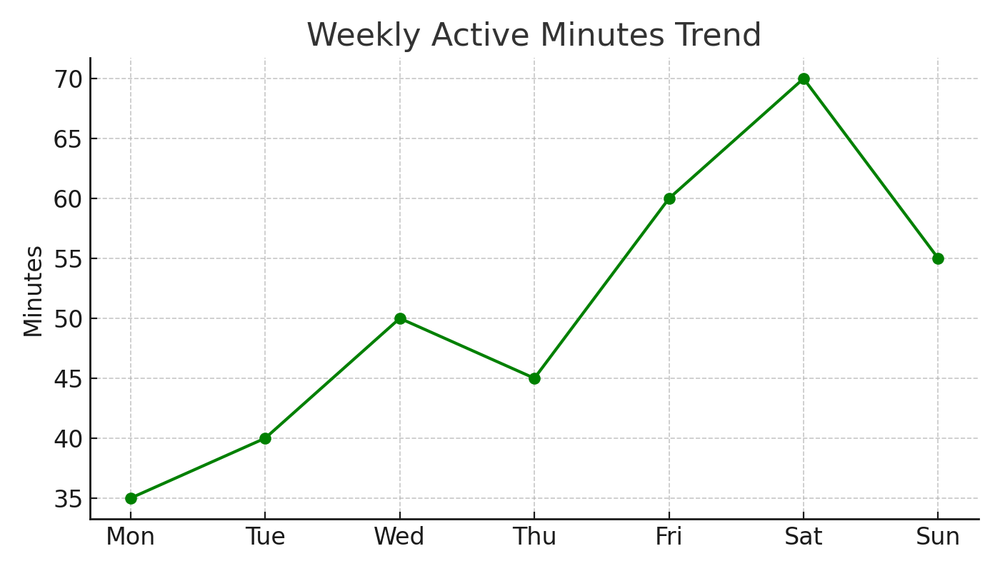

# Bellabeat Case Study 💚

## 📝 Project Title
Bellabeat Fitness Device Usage Analysis

## 👤 Author
By Sainivas

## 📊 Tools Used
- Excel
- Data Cleaning
- Pivot Tables
- Charts (Line, Column, Pie)

## 📁 Dataset
FitBit Fitness Tracker Data (via Kaggle)

---

## 📌 Overview
Bellabeat is a high-tech company that manufactures health-focused smart products for women. The goal is to analyze usage data from smart fitness devices and provide insights to support Bellabeat’s marketing strategy.

---

## 🎯 Objective
To explore how users engage with their fitness devices and identify trends and opportunities to improve Bellabeat's user engagement and growth.

---

## 🔍 Key Analysis Performed
- Cleaned and organized FitBit data using Excel  
- Analyzed daily activity, sleep, steps, and calories  
- Created visualizations to uncover usage behavior patterns  

---

## 📈 Insights
- Majority of users do not meet recommended daily activity levels  
- Higher activity levels are correlated with higher calories burned  
- Inconsistent sleep patterns may suggest opportunity for improvement through app nudges and tips  

---

## ✅ Recommendation
Bellabeat should focus on personalized notifications to boost consistent use, encourage daily activity, and promote healthy sleep routines through the app.

---

## 📷 Visuals
  
  

---

## 📄 Case Study Report
Download the [Bellabeat Case Study PDF](Bellabeat_Case_Study.pdf)
